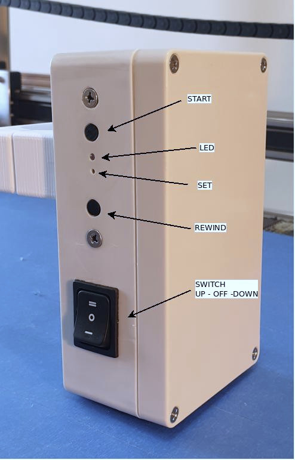

# FlagRaiser V1.0 configuration

The device has three 3 buttons:  UP - SET - DOWN 

## Modes
1. Operational [solid blue led]
2. Setting mode  
   Pole lengh setting [slow blinking blue led]  
   Song lenght setting [fast blinking blue led]  

Upon turn on, the device defaults to Operational mode. 
In this (standard) mode the button UP will comence the flag raising  
at a speed based on previous settings of Pole and Song length. Note  
that the HOME postion (position zero) becomes the point at wich the 
device was wen turned on. Before every use ensure that the flag 
is at it lowest postion before turning all the device.

## Enrering Setting modes

* Start with the flag at its lowest position and turn on the device.  
* Using a clip press the middle button (SET) through the pinhole once.  
* The blue LED will start to blink at a slow pace (once a second).  
* Now the device is in Pole-Lenght setting mode.   
* Using the UP button, bring the flag to the top of the pole (the DOWN  
button can be used for fine adjustments). 
* Once you are satified with the end position press the middle button 
through the pinhole once to save the position. 
* The flag will return down to zero automatically and the LED will now 
flash rapidly (4 times a second) indicating that the device is now 
in Song-Lengh setting mode. 
* Start the song on a music player and press the DOWN button once when 
the song has started
* Press the DOWN button one more time at the end of the song.
* The LED will return to solid indicating that the Song-Lenght and 
Pole-length have been saved.

The device will save the settings in its flash memory and reuse them
when turned on.

